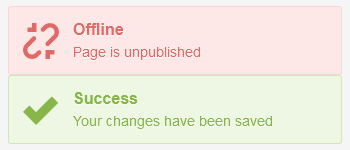
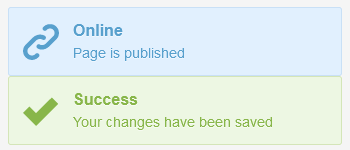
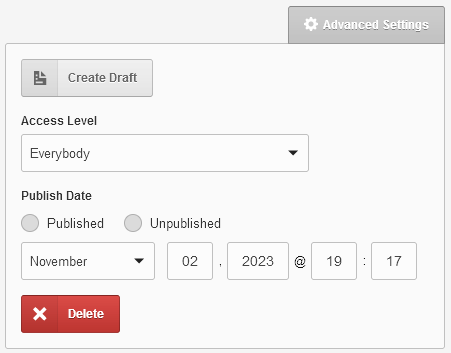

# A theme *Ryazania* for CouchCMS *free

> Disclaimer: *free means free for you on your hobby website. If you make websites for others, then it's a small price for a licence per each domain. Full version is way-way more packed.

Our goal is new QoL experience; a thorough compilation and collection of mods, tweaks, addons and other helpers to make development faster. If we need something we write it. Some tweaks are integrated within theme snippets and can not be disabled easily.

Many more tweaks can be enabled or disabled at will. There are 2 types of folders:

+ `*-enabled`
+ `*-available`

If you move a folder with tweak from `/tweaks-available/` to `/tweaks-enabled/` it is ***enabled***. Move back to `/tweaks-available/` and it is ***disabled***. Same with tags, vars, etc.

# list of stuff:

## Gallery with drag&drop reorder

Reorder images in gallery via drag&drop, not just stock buttons.

- `/tweaks-enabled/[Gallery] gallery-drag-drop/`
- `content_list_inner_gallery.html`
- `gallery_folder.html`
- `gallery_item.html`

## Fast removal of deleted fields

Added a **Delete All** button to remove all missing/deleted fields at once, instead of clicking each missing field's alert one-by-one.

Example

- `form_field_deleted.html`

## A duplicate button '**Save**', '**View**'

Both '**Save**' and '**View**' buttons appear together in top and in bottom of page.

- `toolbar.html`
- `page_actions.html`

## Animated smooth scroll to bottom

Upon click on '**Save**' the page is reloaded and is scrolled back to the previous view in the page's bottom. Click on topmost button does the regular thing without scroll.

- `/tweaks-*/[AP Edit-view] animate-scroll-on-save/`

## Various fixes and tweaks in system CSS

Various CSS tweaks for core fields and tables. Details are added as comments to the theme file:

- `styles.css`

## Can close "Related to:" banner and return to orig page

Adds **`X`** to "Related to:" admin infoalert and redirect page to ordinary URL if clicked.

- `filter_related.html`

## View a reverse_related page & 'Manage' is enabled by default

Add a button "View" to Advanced GUI selector. Button opens single-related page in admin panel.
Manage button is enabled by default where appropriate.

- `field_relation_advanced.html`

## Masterpage-specific view override

Has code that allows placing in theme folder masterpage-specific snippets, e.g. `content_form__blog-php.html` will be loaded for blog.php and `content_form.html` for any other masterpage.

- `kfunctions.php`

## A Toastr confirms count of deleted pages

If in list-view a few pages are deleted, then a Toastr confirmation is displayed with count

- `content_list_inner.html`
- `/tweaks-*/[AP List-view] flash-msg-upon-delete/`

## A Toastr notification upon publishing-unpublishing page

Bottom right corner is a usual place for alerts, now having one more status

Online-Offline

- `content_form.html`

## Always loading Grid CSS (grid12.css)

- `content_form.html`

## Tweak of dimming

Now it lightens up a little

- `content_list_relation.html`

## Delete page button appears

in advanced settings.

- `group_advanced_settings.html`

# and many many more...

Tags, addons, vars, shortcodes, scripts, tweaks, validators.

# Credits

Anton S.\
tony.smirnov@gmail.com
